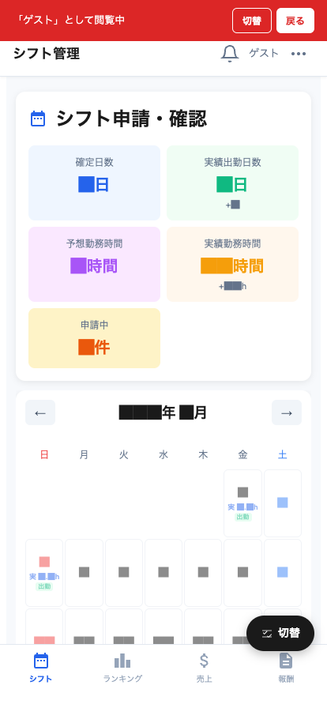

# シフト

シフト申請と確認ができるメイン画面です。アプリを開くとこの画面が表示されます。

## 画面構成

| エリア | 説明 |
|---|---|
| シフト申請・確認 カード | 当月の集計（確定日数、実績出勤日数、予想/実績勤務時間、申請中件数） |
| ← 年/月 → ナビ | 表示する月を切り替え |
| カレンダー | 日付ごとのシフト状態を表示 |
| 下部ナビ | シフト / ランキング / 売上 / 報酬 |

## カードの意味

| 項目 | 内容 |
|---|---|
| **確定日数** | 管理者が確定したシフトの日数 |
| **実績出勤日数** | 実際に出勤した日数（+番号で当日プラスの予定数も） |
| **予想勤務時間** | 確定シフトから計算される今月の勤務時間 |
| **実績勤務時間** | 実際の勤怠から計算される時間（+h で残りの想定時間） |
| **申請中** | まだ承認されていない自分のシフト申請数 |

## カレンダーのセル表示

| 表示 | 意味 |
|---|---|
| 「実 ██h」「出勤」（緑） | 出勤実績あり |
| 数字のみ（グレー） | 何も登録なし |
| 「申請中」 | 自分からシフト申請を出して承認待ち |
| 「確定」 | 管理者が確定済み（当日のシフト） |

## よく使う操作

### シフト申請を出す

1. カレンダーで **未登録の日付セル** をタップ
2. シフト申請モーダルが開く
3. **開始時間 / 終了時間** をプルダウンで選択
4. 「**申請する**」ボタンで送信

> 💡 過去の日付には申請できません（編集不可）。

### 既存のシフト申請を変更・取消する

1. 申請中のセル（「申請中」表示）をタップ
2. モーダルから時間変更 or 「**取消**」ボタン

### 月をまたいで確認する

カレンダー上部の **← 年/月 →** ナビで前月・翌月を表示。

### 確定したシフトの確認

「**確定**」表示のセルは管理者が承認・確定済みのシフトです。
- 出勤予定として給与計算の対象になります
- 変更したい場合は管理者に直接連絡してください（アプリからは変更不可）

## 通知ベル（🔔）

画面右上のベルアイコンに数字が付いていたら新着お知らせがあります。タップして内容確認できます。
- シフト承認のお知らせ
- 管理者からの一斉連絡
- 給与明細の発行通知 など
