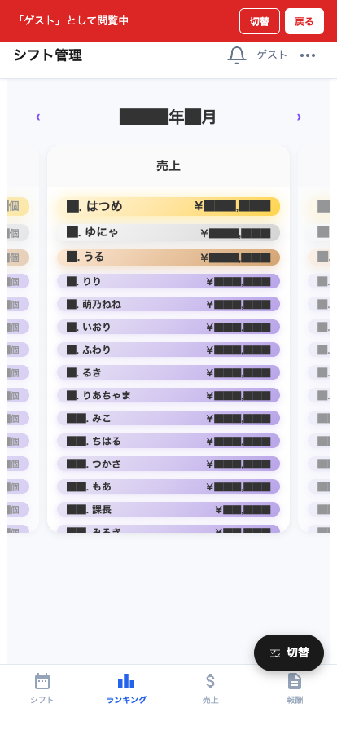

# ランキング

店舗内のキャスト売上ランキングを確認できる画面です。

## 画面構成

| エリア | 説明 |
|---|---|
| 期間切替 | 今日 / 今週 / 今月 などで集計期間を切替 |
| ランキング一覧 | 1 位から順にキャストの写真・名前・売上金額 |
| 自分の順位ハイライト | 自分の行はハイライト表示 |

## よく使う操作

### 期間を切り替える

上部のタブで「**今日 / 今週 / 今月**」を切替。
- 今日の即時集計を見たい時は「今日」
- 月間順位を見たい時は「今月」

### 自分の順位を確認する

ランキングをスクロールすると自分の行がハイライトされています。
- 上位者との差額も確認できる
- モチベーション維持にどうぞ

> 💡 ランキングはリアルタイムではなく、数分に 1 度更新されます。POS で会計が締まってから少し時間がかかる場合があります。
