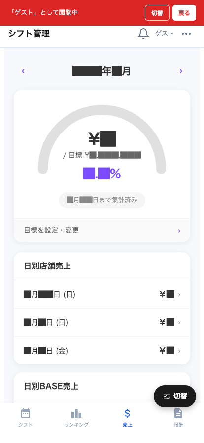

# 売上

自分の月間売上明細を確認できる画面です。

## 画面構成

| エリア | 説明 |
|---|---|
| ← 年/月 → ナビ | 表示する月を切り替え |
| 月間サマリ | 月の総売上、出勤日数、客数 等 |
| 日別売上 | 日ごとの売上明細 |
| 商品別売上 | 売れた商品の内訳 |

## よく使う操作

### 月を切り替える

ナビゲーションで前月・翌月を表示。給与明細と日付を合わせて確認すると分かりやすい。

### 日別の明細を見る

日付の行をタップすると、その日の伝票明細が確認できる場合があります（実装に依存）。

### 商品別ランキングを見る

その月に自分の伝票で売れた商品の集計が表示されます。
- どの商品が多く出たか
- 高単価商品の比率
- 営業の参考に

> 💡 売上の集計は POS の伝票データと連動。POS で修正があった場合は数分以内に反映されます。
