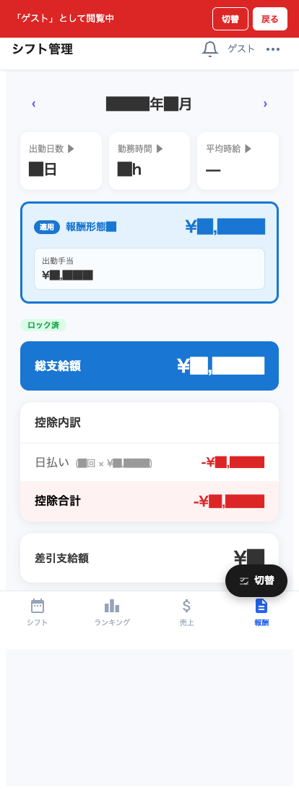

# 報酬

自分の月間給与明細を確認できる画面です。

## 画面構成

| エリア | 説明 |
|---|---|
| ← 年/月 → ナビ | 表示する月を切り替え |
| 月の合計 | 総支給額・控除合計・差引支給額 |
| 内訳: 時給収入 | 勤務時間 × 時給 |
| 内訳: 売上バック | 売上に応じたバック |
| 内訳: 商品バック | カテゴリ・商品ごとのバック |
| 内訳: 固定額 | 固定支給があれば |
| 内訳: 出勤手当 | 1出勤あたりの支給 |
| 内訳: 賞与 | 特別賞与 |
| 控除 | 日払い・源泉徴収・その他控除 |
| 差引支給額 | 実際に手元に入る金額 |

## 用語解説

| 用語 | 意味 |
|---|---|
| **時給収入** | 勤務時間 × 時給。出勤しないとつかない |
| **売上バック** | 自分の売上に応じた歩合 |
| **商品バック** | シャンパン等、商品カテゴリごとのバック |
| **固定額** | 役職手当や指名固定額など |
| **出勤手当** | 1日いくらの固定手当 |
| **賞与** | 特定の条件で支給される追加報酬 |
| **日払い** | 当日に現金で受け取った分（給与から差し引かれる） |
| **源泉徴収** | 所得税の源泉徴収 |
| **その他控除** | 制服代、罰金等 |

## よく使う操作

### 月を切り替える

ナビで前月・翌月を表示。締日後の確定明細を確認したい時は前月を選びます。

### 明細項目の詳細を見る

各項目の **▶ ボタン or タップ** で内訳の計算式や対象日が展開表示されます（実装に依存）。

### 給与の質問がある場合

明細の数字に疑問がある時は、画面の **「⋯ メニュー → 申請」** から「給与に関する問い合わせ」を送るか、お店の管理者に直接連絡してください。

> 💡 明細は月次確定後に正式版になります。途中段階では「速報値」として表示される場合があります。
