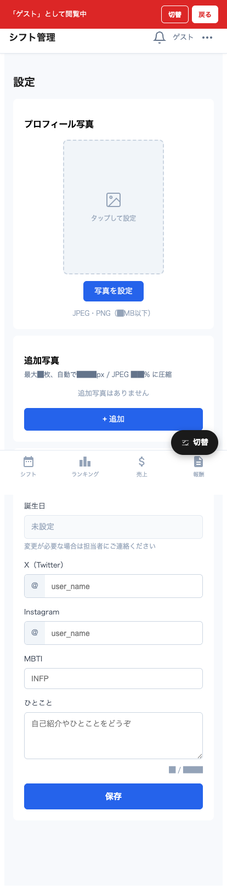

# 設定

プロフィール写真や自己紹介情報を編集する画面です。アプリ右上の **「⋯ メニュー → 設定」** から入れます。

## 画面構成

主なセクション:

1. **プロフィール写真** — メイン写真（出勤表・ホームページ用）
2. **追加写真** — Webサイトの個別ページ用（最大3枚）
3. **プロフィール情報** — X (Twitter) / Instagram / 自己紹介
4. **その他** — 表示設定や通知設定

## プロフィール写真

ホームページや出勤表に使われるメイン写真です。

### 写真をアップロードする

1. 写真エリアをタップ → ファイル選択 or カメラ起動
2. **JPEG / PNG**、5MB 以下推奨（自動圧縮あり）
3. 切り抜きが必要な場合は範囲調整画面が出る
4. 「**保存**」ボタンでアップロード

### 写真を変更する

既存写真の上の「**写真を変更**」ボタン → 新しい写真を選択。

## 追加写真（Webサイト用、最大 3 枚）

Web サイトの個別ページに表示される追加の写真。

### 追加写真をアップロードする

1. 「**+ 追加**」ボタン → ファイル選択
2. 自動で 1200px / JPEG 85% に圧縮
3. アップロード完了で一覧に表示

### 並び替え・削除

- **‹ / ›** ボタンで前後に移動
- **✕** ボタンで削除

## プロフィール情報（HP用）

ホームページに表示される情報です。

| 項目 | 説明 |
|---|---|
| X（Twitter） | アカウント ID（@抜き） |
| Instagram | アカウント ID |
| 自己紹介 | 短い紹介文（HP に表示される） |
| MBTI | 性格タイプ（任意） |
| 一言 | プロフカードに使う一言 |

入力後 **「保存」ボタン** で確定。

> 💡 ホームページに反映されるまで数分かかる場合があります。
