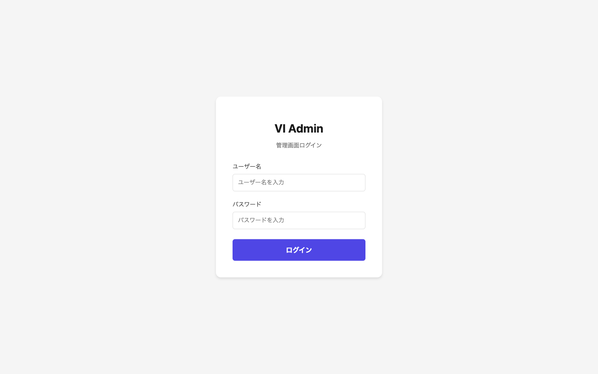
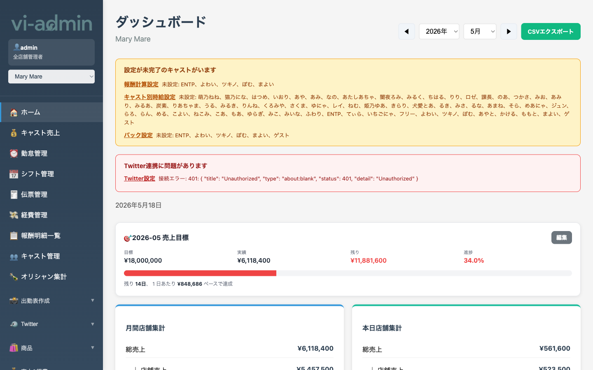

# はじめに

VI Admin は店舗の売上・キャスト・シフト・報酬を一括管理する PC 専用ダッシュボードです。
本マニュアルはよく使う画面と操作手順をまとめたものです。

## 動作環境

- **PC ブラウザ専用**（Chrome / Safari / Edge 推奨）
- スマホ・タブレットからアクセスすると一部ページが利用できません
- インターネット接続必須

## ログイン

ブラウザで https://vi-admin-psi.vercel.app/ にアクセスするとログイン画面が表示されます。

| 項目 | 説明 |
|---|---|
| ユーザー名 | 管理者から発行された ID |
| パスワード | 初期パスワードを入力（必要に応じて後で変更） |

「ログイン」ボタンを押すとホーム画面に遷移します。

> 💡 セキュリティ強化のため、毎日 **13:00（昼）に自動でログアウト** されます。再度ログインしてください。

## 画面構成

ログイン後は左サイドメニュー + 右メイン画面の 2 ペイン構成です。

### サイドメニュー

| 項目 | 説明 |
|---|---|
| 🏠 ホーム | ダッシュボード（売上・経費・本日の状況） |
| 💰 キャスト売上 | キャスト別月間売上集計 |
| ⏰ 勤怠管理 | 月間勤怠カレンダー、出勤表印刷 |
| 📅 シフト管理 | 確定シフトの編集 |
| 🧾 伝票管理 | 注文伝票の一覧・編集 |
| 💸 経費管理 | 経費登録・集計 |
| 📋 報酬明細一覧 | 全キャストの月間給与明細 |
| 👥 キャスト管理 | キャスト追加・編集 |
| 🍾 オリシャン集計 | シャンパン集計 |
| 📸 出勤表作成 ▼ | 出勤表写真の管理・テンプレ・生成 |
| 🐦 Twitter ▼ | 予約投稿・Twitter 設定 |
| 🛍️ 商品 ▼ | 商品・カテゴリーマスタ |
| 💰 売上&経費 ▼ | 売上計算ルール等 |
| 💳 報酬設定 ▼ | 時給・バック・控除等 |
| 🌐 Webサイト ▼ | 公開サイト用バナー管理 |
| ⚙️ 設定 ▼ | 店舗情報、LINE 連携 |
| 🔐 管理者専用 ▼ | super_admin のみ。複数店舗管理 |
| 🚪 ログアウト | 手動ログアウト |

> ▼ マークの項目はクリックで展開され、サブメニューが表示されます。

### 店舗切替

サイドメニュー上部のドロップダウンで店舗を切り替えます（複数店舗管理者の場合のみ）。

選択した店舗が **全ページに反映** されます。「キャスト売上」「シフト管理」「報酬明細」など、画面ごとに毎回選び直す必要はありません。

### ユーザー情報

サイドメニュー上部に現在ログイン中のユーザー名と権限が表示されます。

| 権限 | 操作範囲 |
|---|---|
| 全店舗管理者 (super_admin) | 全店舗 + 管理者専用ページ |
| 店舗管理者 (store_admin) | 自店舗のみ |
| その他 | 権限設定に応じて画面ごとに制御 |

## トラブルシューティング

### ログインしても画面が真っ白 / データが見えない

ブラウザのキャッシュが古い可能性があります。一度ログアウトしてから再ログインしてください。

### 「PC専用ページです」と表示される

スマホ・タブレットからアクセスしているか、画面幅が狭すぎる可能性があります。PC で開くか、ブラウザ幅を広げてください。

### ログイン後すぐにログイン画面に戻される

セッションが切れています。毎日 13:00 の自動ログアウトに重なった可能性があります。再度ログインしてください。
