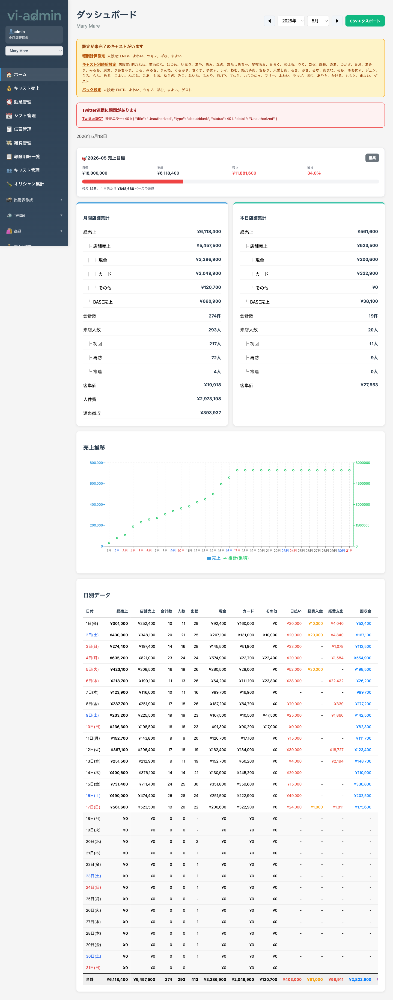

# ホーム画面

ログイン直後に表示されるダッシュボード画面です。当日の状況と月間の売上推移を一目で確認できます。

## 画面構成

ホーム画面は上から以下のセクションで構成されています。

| セクション | 内容 |
|---|---|
| 通知バー | 「設定が未完了のキャスト」「Twitter連携の問題」等のお知らせ |
| 当日サマリ | 本日の売上・経費・客数等 |
| 売上目標進捗 | 月間売上目標に対する進捗率 |
| 売上推移グラフ | 月間の日別売上を棒グラフで表示 |
| 日別データ | 当月の日別売上明細（現金・カード・その他） |

## 通知バー

設定が不完全だったり外部連携にエラーが出ていると、画面上部に黄色〜赤の通知バーが表示されます。

| 通知 | 意味 | 対処 |
|---|---|---|
| 設定が未完了のキャストがいます | compensation_settings が未設定のキャスト | キャスト管理 → 該当キャストの設定を確認 |
| Twitter連携に問題があります | アクセストークン期限切れ | Twitter 設定 → 再連携 |

## 当日サマリ

本日の現在時点の数値を表示します。

| 項目 | 内容 |
|---|---|
| 売上 | 本日締めた伝票の合計（税込） |
| 客数 | 本日来店の組数 |
| 客単価 | 売上 ÷ 客数 |
| 現金/カード/その他 | 支払方法別の内訳 |

> 💡 数値は POS でのレジ締めと連動。POS で伝票を確定した瞬間に反映されます。

## 売上目標進捗

月初に設定した売上目標に対する達成率です。

- バーが緑 → 達成見込みあり
- バーが黄色 → ペース注意
- バーが赤 → 大幅未達

> 💡 月間売上目標は「設定 → 売上目標設定」で店舗ごとに登録できます。

## 売上推移グラフ

当月の日別売上を棒グラフで表示。前月との比較も可能。

## 日別データ

当月の日別売上を表形式で表示します。

| 列 | 内容 |
|---|---|
| 日付 | 営業日（日曜は赤、土曜は青で表示） |
| 売上合計 | その日の総売上 |
| 現金 | 現金支払いの合計 |
| カード | カード支払いの合計 |
| その他 | 売掛・電子マネー等 |
| 客数 | 来店組数 |

> 💡 行をクリックすると伝票管理画面に飛んで、その日の伝票一覧を見られます（実装次第）。

## よく使う操作

### 当日の数字を確認する

1. ログイン直後の画面で確認可能
2. 数字が古いと感じたら、ブラウザの再読み込み（F5 / Cmd+R）で最新化

### 売上目標を設定する

1. サイドメニューの「⚙️ 設定」を展開
2. 「売上目標設定」を選択
3. 年月と目標金額を入力して保存

設定した目標は翌日以降のホーム画面に反映されます。

### 別の店舗の状況を見る

1. サイドメニュー上部の店舗ドロップダウンを開く
2. 店舗を選択
3. ホーム画面が自動的にその店舗の数値で更新される

> 💡 super_admin（全店舗管理者）のみ操作可能。店舗管理者は自店舗のみ表示。
