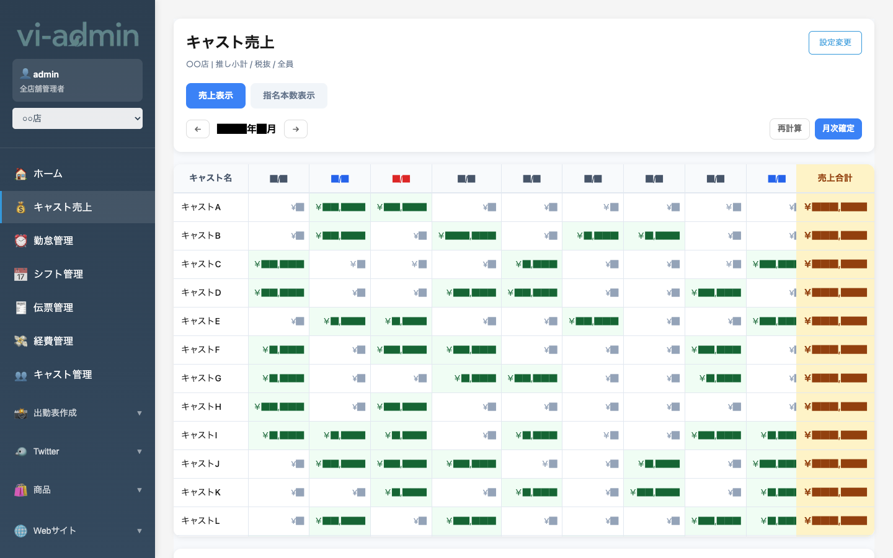
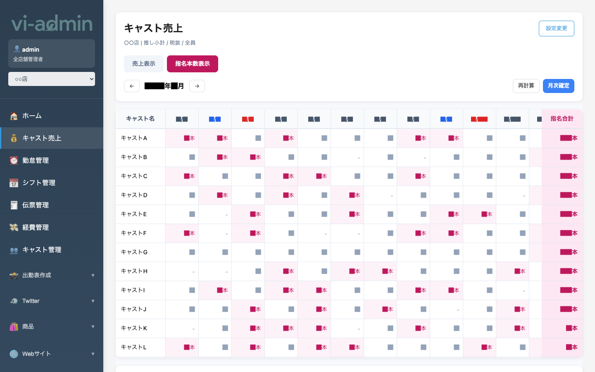

# キャスト売上

キャスト別の月間売上を一覧で確認できる画面です。日別の売上額と月の合計が表で見られます。

## 画面構成

| エリア | 説明 |
|---|---|
| ページタイトル下の表記 | 「店舗名 / 推し小計 / 税抜 / 全員」など、現在の表示条件 |
| 売上表示 / 指名本数表示 タブ | 表の中身を切替（金額 ↔ 指名本数） |
| ← 年月 → ナビ | 表示する月を切り替え |
| 再計算 ボタン | 売上・指名本数を最新の伝票状態で再計算（時間かかる場合あり） |
| 月次確定 ボタン | その月の数字を確定（編集ロック） |
| 設定変更 ボタン | 表示条件（税抜/税込・推し/ヘルプ・全員/指名）を変更（管理者向け） |
| 表本体 | 行=キャスト、列=日付、最後列=合計 |

## 表示モード

### 売上表示（デフォルト）

各セルにキャストのその日の売上額を表示します。バーの長さで売上の大きさを直感的に把握できます。
右端の **売上合計** 列でキャストの月間合計が見られます。

### 指名本数表示

タブを「指名本数表示」に切り替えると、各セルがその日の **指名本数**（◯本）の表示に変わります。
右端の **指名合計** 列でキャストの月間累計本数が見られます。

## よく使う操作

### 月を切り替える

タブ下の **← 年/月 →** ナビゲーションで前月・翌月に移動できます。

### 最新の状態に再計算する

伝票を編集した直後など、画面の数字が古い場合は **「再計算」ボタン** を押します。
- 当月分の全キャストの売上・指名本数を最新の伝票状態で再集計します
- 処理中は他の操作を控えてください（数十秒〜数分かかることがあります）

### 月次確定

その月の売上集計を確定したいときに **「月次確定」ボタン** を押します。
- 確定後、その月の数字は固定され、編集できなくなります
- 給与計算と整合性を保ちたい時点で押す運用がおすすめ

> 💡 「月次確定」は元に戻せる場合と戻せない場合があります。確定前に内容を必ず確認してください。

### 表示条件を変える

右上の **「設定変更」** ボタンから、表示する数字の集計方法を選べます（管理者向け機能）。
- 推し小計 / ヘルプ込み
- 税抜 / 税込
- 全員 / 指名のみ

> 💡 設定変更画面は管理者専用です。店舗管理者は通常デフォルトのまま使えばOKです。
