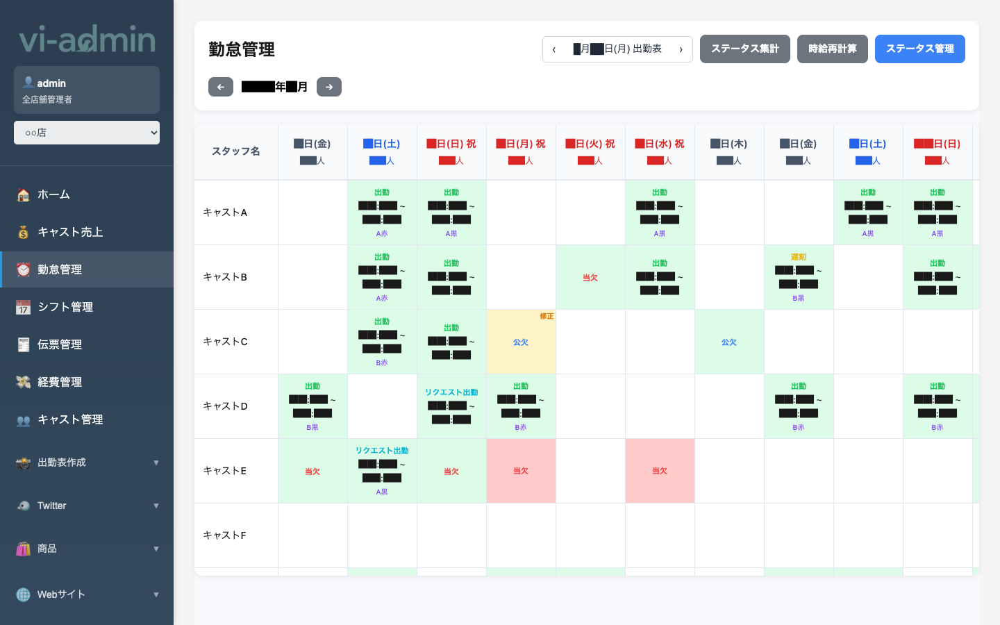
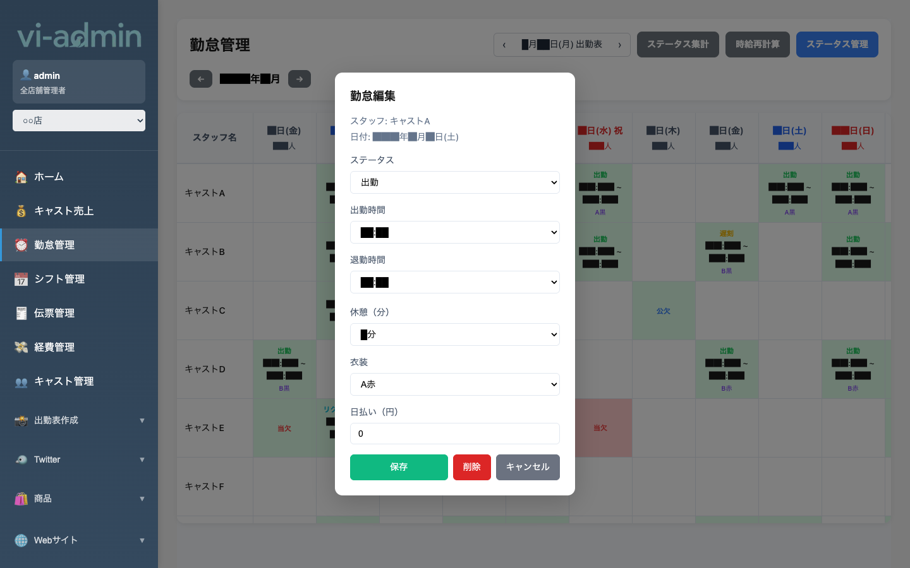

# 勤怠管理

キャストの出勤・遅刻・欠勤などの勤怠を月間カレンダー形式で確認・編集できる画面です。

## 画面構成

| エリア | 説明 |
|---|---|
| ← 年/月 → ナビ | 表示する月を切り替え |
| ‹ M月d日(曜) 出勤表 › ボタン | 指定日の出勤表を印刷（日付の左右矢印で日を切り替え、中央クリックで印刷） |
| ステータス集計 ボタン | キャストごとの月間ステータス（出勤回数、遅刻回数等）の集計表を印刷 |
| 時給再計算 ボタン | 当月の勤怠を時給設定で再計算（ステータス変更・時給変更後に使用） |
| ステータス管理 ボタン | 「出勤」「遅刻」等のステータス項目自体を編集（ステータスマスタ管理） |
| 表本体 | 行=スタッフ、列=日付。セルにステータスと時間・衣装を表示 |

## セルの色とステータス

| 表示 | 意味 |
|---|---|
| 緑「出勤」 + 時間 + 衣装 | 通常出勤（時間範囲と着用衣装が表示される） |
| 黄「遅刻」 + 時間 + 衣装 | 遅刻出勤 |
| 赤「当欠」 | 当日欠勤 |
| 「公欠」 | 事前申請の欠勤（公休扱い） |
| 青「リクエスト出勤」 | シフトアプリ経由でキャストが入れたリクエスト（未確認） |
| オレンジ「修正」 | 何らかの修正フラグあり |
| 空白 | 何も登録なし |

## よく使う操作

### 勤怠を編集する（セルをクリック）

カレンダーの任意のセルをクリックすると **勤怠編集モーダル** が開きます。

| 項目 | 説明 |
|---|---|
| スタッフ / 日付 | 対象のキャストと日付（読み取り専用） |
| ステータス | 出勤 / 当欠 / 事前欠勤 / 無欠 / 遅刻 / 早退 / 公欠 / リクエスト出勤 から選択 |
| 出勤時間 | プルダウンで15分刻みの開始時刻を選択 |
| 退勤時間 | プルダウンで15分刻みの終了時刻を選択 |
| 休憩（分） | 休憩時間（プルダウン） |
| 衣装 | 制服の種類（A赤、A黒、B赤、B黒…） |
| 日払い（円） | その日に渡した日払い額 |
| 保存 | 入力内容で保存 |
| 削除 | 既存の勤怠データを削除 |
| キャンセル | 変更を破棄して閉じる |

### 出勤表を印刷する

画面右上の **「‹ M月d日(曜) 出勤表 ›」** ナビを使います。

1. **左右の矢印 ‹ ›** で日付を切り替え
2. **中央の日付テキスト** をクリック → 印刷ダイアログが開く

> 💡 出勤表には予定シフト（シフト管理で確定済みの時間帯）が自動で印字されます。

### 月をまたいで確認する

画面左上の **← 年/月 →** で前月・翌月に移動できます。

### ステータス集計を印刷する

右上の **「ステータス集計」** ボタンで、その月のキャスト別ステータス集計表が印刷できます。
- 各キャストの出勤回数 / 遅刻回数 / 欠勤回数 などを表形式で表示
- 月末締めの記録用に便利

### 時給を再計算する

時給設定や勤怠ステータスを変更した後は **「時給再計算」** ボタンで当月の集計を更新できます。
- 処理中は画面を閉じないでください
- 完了後にカレンダー表示も最新になります
