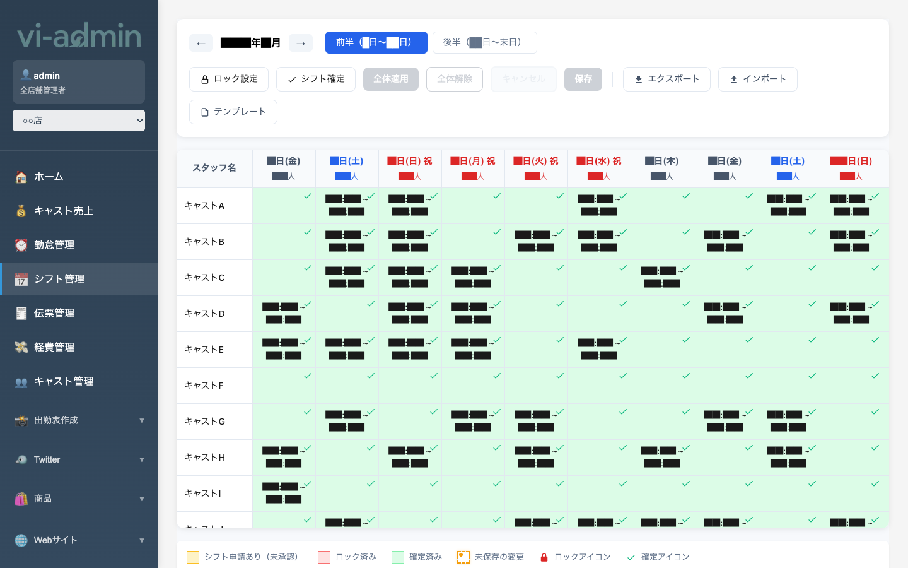
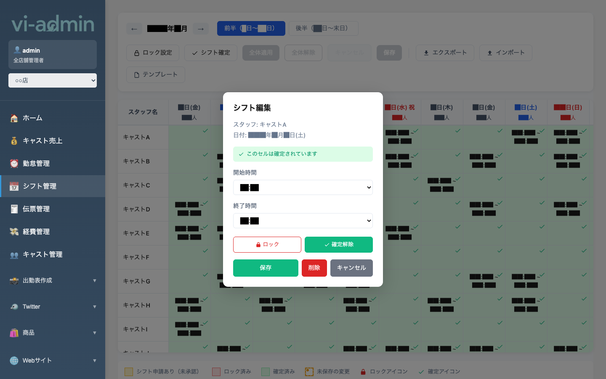

# シフト管理

確定したシフト（誰がいつ何時から何時まで出勤するか）を月単位で管理する画面です。
キャストから上がってきたシフト希望（リクエスト）を承認・調整した上で、最終的なシフトを確定します。

## 画面構成

| エリア | 説明 |
|---|---|
| ← 年/月 → ナビ | 表示する月を切り替え |
| 前半 (1日〜15日) / 後半 (16日〜末日) | 月内の前半／後半を切替（画面幅対策） |
| ロック設定 | 各キャストごとに編集ロックを設定（誤編集防止） |
| シフト確定 | 当月のシフトを「確定済み」状態にする（給与計算の元データ） |
| 全体適用 / 全体解除 | テンプレートを一括適用 or 一括解除 |
| キャンセル / 保存 | 編集中の変更を破棄／保存 |
| エクスポート / インポート | シフトを CSV で書き出し／取り込み |
| テンプレート | 曜日ごとの定型シフトテンプレを管理 |
| 表本体 | 行=スタッフ、列=日付。セルに開始～終了時間と確定/未確定マーク |

## 凡例（画面下）

| 表示 | 意味 |
|---|---|
| 黄色セル | シフト申請あり（キャストから上がってきた未承認のリクエスト） |
| ピンクセル | ロック済み（編集不可） |
| 緑セル | 確定済み |
| オレンジ枠 | 未保存の変更（保存ボタン押すまで反映されない） |
| 🔒 ロックアイコン | このセルはロック中 |
| ✓ 確定アイコン | このセルは確定済み |

## よく使う操作

### シフトを編集する（セルをクリック）

カレンダーの任意のセルをクリックすると **シフト編集モーダル** が開きます。

| 項目 | 説明 |
|---|---|
| スタッフ / 日付 | 対象のキャストと日付（読み取り専用） |
| 確定状態 | 既に確定済みのセルはその旨が表示される |
| 開始時間 | プルダウンで15分刻みの開始時刻を選択 |
| 終了時間 | プルダウンで15分刻みの終了時刻を選択 |
| 保存 / 削除 / キャンセル | 入力で保存、既存削除、変更破棄 |

### シフト希望（リクエスト）を承認する

キャストがシフトアプリから入れたリクエストは **黄色セル** で表示されます。
そのセルをクリックして開始・終了時間を確認、問題なければ「保存」で確定に変えられます。

### シフトを確定する

月のシフトが固まったら、画面上部の **「シフト確定」ボタン** を押してその月の状態を確定化します。
- 確定後は給与計算の前提として使われます
- 個別セルだけ確定する場合は、編集モーダルから時間を変更して保存すれば該当セルだけ確定状態になります

### テンプレートで一括入力する

毎週同じ曜日に同じ時間で入る場合は **「テンプレート」** で曜日ごとの定型を作っておき、
**「全体適用」** ボタンで一括入力できます。
- 既存の確定済みセルを上書きしないように注意
- 「全体解除」で適用を取り消せます

### CSV で取り込み・書き出し

紙の出勤表から取り込みたい場合や、他システムとデータを連携したい場合は **「インポート / エクスポート」** が使えます。
