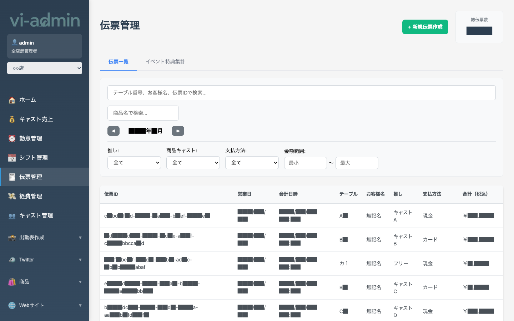

# 伝票管理

POS で登録された注文伝票を一覧で確認・編集できる画面です。月単位で絞り込みや検索ができます。

## 画面構成

| エリア | 説明 |
|---|---|
| + 新規伝票作成 ボタン | 手動で伝票を追加（緊急時・POS忘れ時の補正など） |
| 総伝票数 | 現在の絞り込み条件に合致する伝票件数 |
| 伝票一覧 / イベント特典集計 タブ | 通常一覧表示 ↔ イベント特典の集計表示 |
| テーブル番号・お客様名・伝票ID で検索 | フリーワード検索 |
| 商品名で検索 | 含む商品から絞り込み |
| ◀ 年/月 ▶ ナビ | 月を切り替え |
| フィルター | 推し / 商品キャスト / 支払方法 / 金額範囲 |
| 表本体 | 伝票一覧（伝票ID / 営業日 / 会計日時 / テーブル / お客様名 / 推し / 支払方法 / 合計） |

## よく使う操作

### 伝票を検索する

- **テーブル番号、伝票ID、お客様名** で部分一致検索（上の検索ボックス）
- **商品名** での検索（下の検索ボックス）
- 複数条件は AND 検索

### 推しキャストや支払方法で絞り込む

フィルター行のプルダウンで:
- **推し**: 特定のキャストの伝票だけ
- **商品キャスト**: その商品をオーダーした担当キャスト
- **支払方法**: 現金 / カード / その他 など
- **金額範囲**: 最小〜最大の金額帯

### 伝票を編集する

一覧の行をクリックすると、その伝票の詳細編集画面に遷移します。
- 商品の追加・削除
- 数量変更
- 推しキャストの変更
- 支払方法・金額の修正

> 💡 編集すると売上集計に即時反映されます。「キャスト売上」「ホーム」の数字も連動して更新されます。

### 新規伝票を手動作成する

POS が動かなかった等で伝票がない場合、右上の **「+ 新規伝票作成」** から手動で作成できます。
- テーブル、お客様、商品、支払方法をすべて手入力
- POS と同等の伝票として扱われる

> 💡 通常運用では POS から自動的に伝票が作られるため、この機能は緊急時・補正用です。

### イベント特典集計を見る

「イベント特典集計」タブで、その月の特典（例: バースデー特典、シャンパンタワー）の集計が見られます。
- 何のイベントが何件、いくらの売上を生んだか
- イベント企画の効果測定に使える
