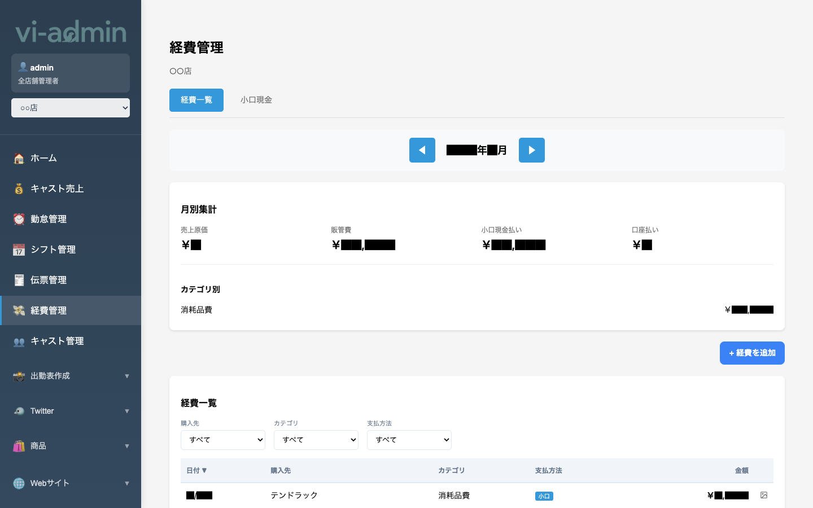
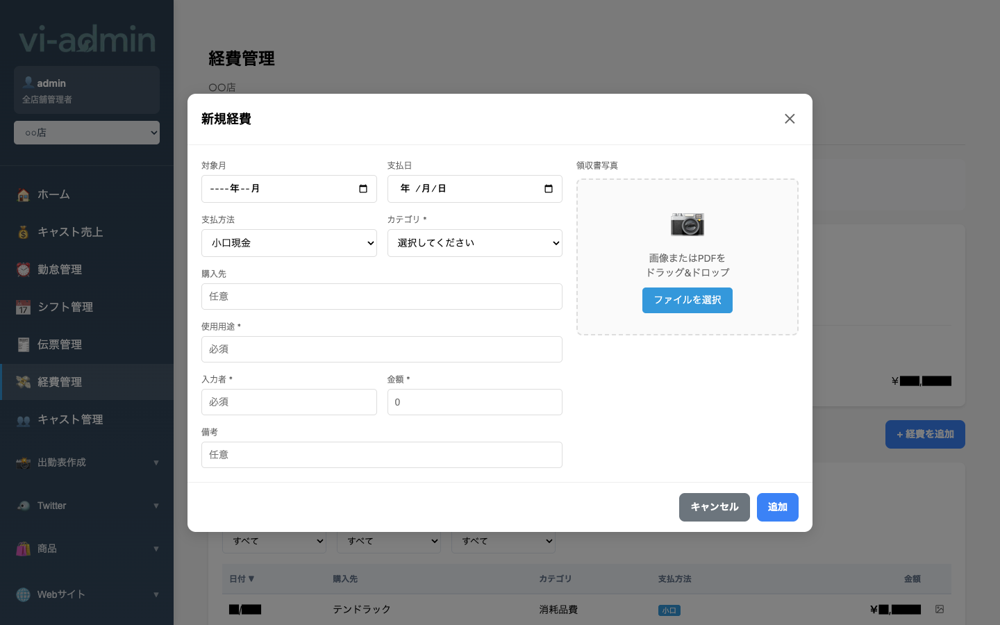

# 経費管理

店舗で発生した経費（仕入れ・消耗品・販管費など）を登録・集計する画面です。
領収書写真を添付して保管できます。

## 画面構成

| エリア | 説明 |
|---|---|
| 経費一覧 / 小口現金 タブ | 通常経費 ↔ 小口現金専用ビュー |
| ◀ 年/月 ▶ ナビ | 月を切り替え |
| 月別集計 | 売上原価 / 販管費 / 小口現金払い / 口座払い の合計 |
| カテゴリ別 | カテゴリごとの小計（消耗品費 など） |
| + 経費を追加 | 新規経費登録モーダルを開く |
| 経費一覧 | 日付 / 購入先 / カテゴリ / 支払方法 / 金額 |
| フィルター | 購入先 / カテゴリ / 支払方法 |

## よく使う操作

### 経費を新規登録する

右上の **「+ 経費を追加」** ボタンを押すとモーダルが開きます。

| 項目 | 必須 | 説明 |
|---|---|---|
| 対象月 | 任意 | 経費を計上する月（例: 2026-05） |
| 支払日 | 任意 | 実際に支払った日 |
| 支払方法 | - | 小口現金 / 口座払い 等 |
| カテゴリ * | 必須 | 経費の種類（消耗品費 / 仕入 / 販管費 等） |
| 購入先 | 任意 | 取引先・店舗名（例: テンドラック） |
| 使用用途 * | 必須 | 何に使ったか |
| 入力者 * | 必須 | 入力した人の名前 |
| 金額 * | 必須 | 半角数字で入力 |
| 備考 | 任意 | 補足メモ |
| 領収書写真 | 任意 | 画像 or PDF をドラッグ&ドロップで添付 |
| キャンセル | - | 変更を破棄して閉じる |
| 追加 | - | 入力内容で保存 |

### 領収書を添付する

「画像またはPDFをドラッグ&ドロップ」エリアに領収書ファイルを放り込めば自動的にアップロードされます。
- 対応形式: JPEG / PNG / PDF
- アップロード後は経費一覧の行末に画像アイコンが表示され、クリックでプレビュー可能

### 経費を絞り込んで見る

経費一覧上部のフィルター（**購入先 / カテゴリ / 支払方法**）で絞り込みできます。

### 小口現金の確認

「**小口現金**」タブで、小口現金の入金・支出履歴と残高が確認できます。
- 業務日報モーダル（ホーム画面）の「経費入金」「経費支出」とも連動

> 💡 月別集計の「売上原価」「販管費」は経費カテゴリの設定に応じて自動分類されます。
