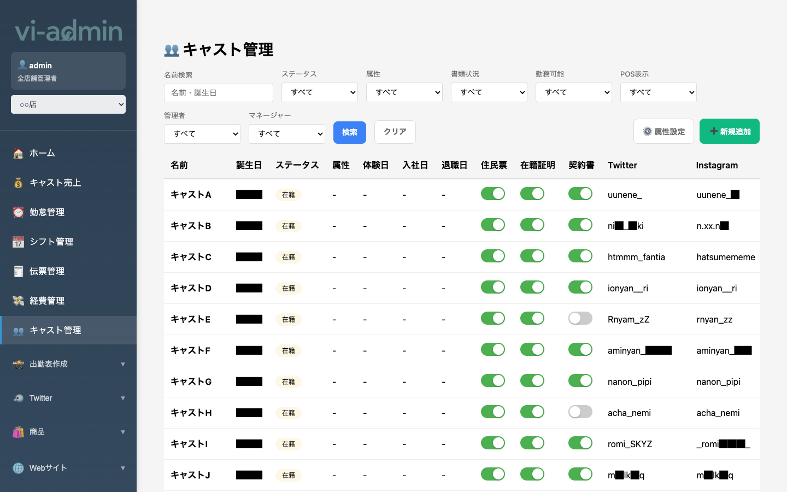
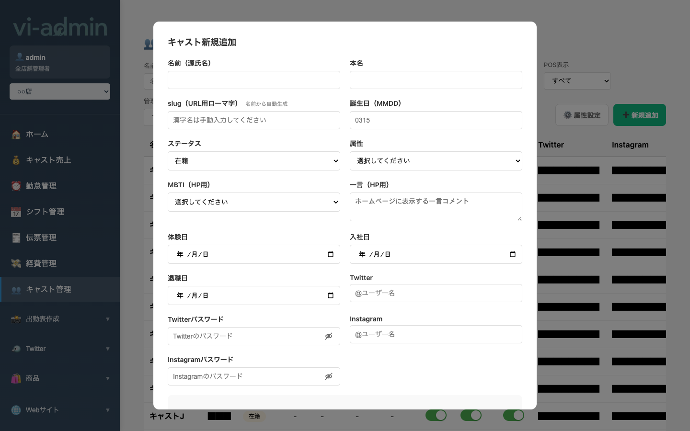

# キャスト管理

在籍中の全キャストを一覧表示し、新規追加・編集・各種情報管理ができる画面です。

## 画面構成

| エリア | 説明 |
|---|---|
| 名前検索 | 源氏名・誕生日で検索 |
| ステータス フィルター | 在籍 / 体験 / 退店 等で絞り込み |
| 属性 フィルター | キャストの属性（タイプ）で絞り込み |
| 書類状況 / 勤務可能 / POS表示 / 管理者 / マネージャー | 各フラグでの絞り込み |
| 検索 / クリア ボタン | フィルター適用 / リセット |
| 属性設定 ボタン | キャスト属性（タグ）のマスタ管理 |
| + 新規追加 ボタン | 新規キャスト登録モーダルを開く |
| 表本体 | 名前 / 誕生日 / ステータス / 属性 / 体験日 / 入社日 / 退職日 / 書類フラグ / SNS |

## 表の各列

| 列 | 内容 |
|---|---|
| 名前 | 源氏名 |
| 誕生日 | MM/DD 形式 |
| ステータス | 在籍 / 体験 / 退店 / 不明 |
| 属性 | キャストのタイプタグ |
| 体験日 | 体験入店した日 |
| 入社日 | 本入店した日 |
| 退職日 | 退店した日 |
| 住民票 / 在籍証明 / 契約書 | 提出書類の有無（トグルで切替） |
| Twitter / Instagram | SNS アカウント名 |

## よく使う操作

### 新規キャストを追加する

右上の **「+ 新規追加」** ボタンを押すとキャスト新規追加モーダルが開きます。

主な入力項目:

| 項目 | 説明 |
|---|---|
| 名前（源氏名） | お店での名前。必須 |
| 本名 | 給与計算用の本名 |
| slug（URL用ローマ字） | Web サイトの個別ページ URL に使う。名前から自動生成（編集可） |
| 誕生日（MMDD） | 4 桁数字（例: 0315 = 3 月 15 日） |
| ステータス | 在籍 / 体験 / 退店 |
| 属性 | 「属性設定」で登録した中から選択 |
| MBTI / 一言（HP用） | ホームページ用プロフィール |
| 体験日 / 入社日 / 退職日 | 各日付 |
| Twitter / Instagram | アカウント名 + パスワード（パスワードは目アイコンで一時表示） |

> 💡 同じ店舗内で同じ源氏名は登録できません。重複してる場合は「(旧)」等を付けるか、退店フラグを立ててから再登録してください。

### キャスト情報を編集する

一覧の行をクリックすると編集モーダルが開きます。新規追加と同じフォームで既存値が入った状態で開きます。

### 属性（タグ）を編集する

右上の **「属性設定」** ボタンから、選択肢を追加・編集できます。
- 属性名を入力 → 追加
- 既存の属性を編集 or 削除

### 在籍書類の管理

各キャストの行で **住民票 / 在籍証明 / 契約書** のトグルをタップして ON/OFF を切替可能。
- 入店時に必要書類が揃ったらON
- 月末の提出書類チェックなどに利用

### 並び替え

行をドラッグ&ドロップで上下に並び替え可能。並び順はシフト・勤怠表での表示順に影響します。
