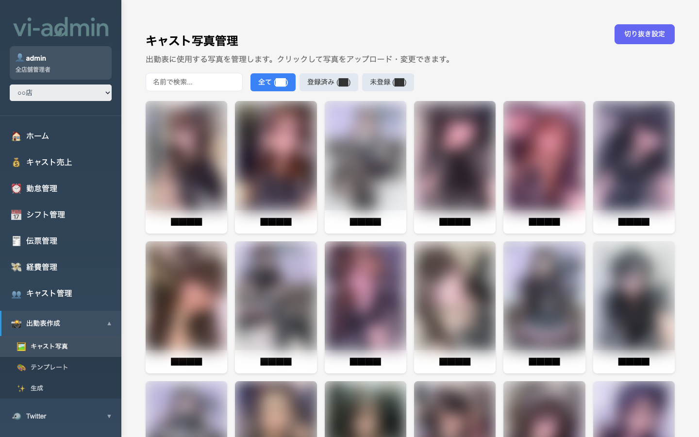
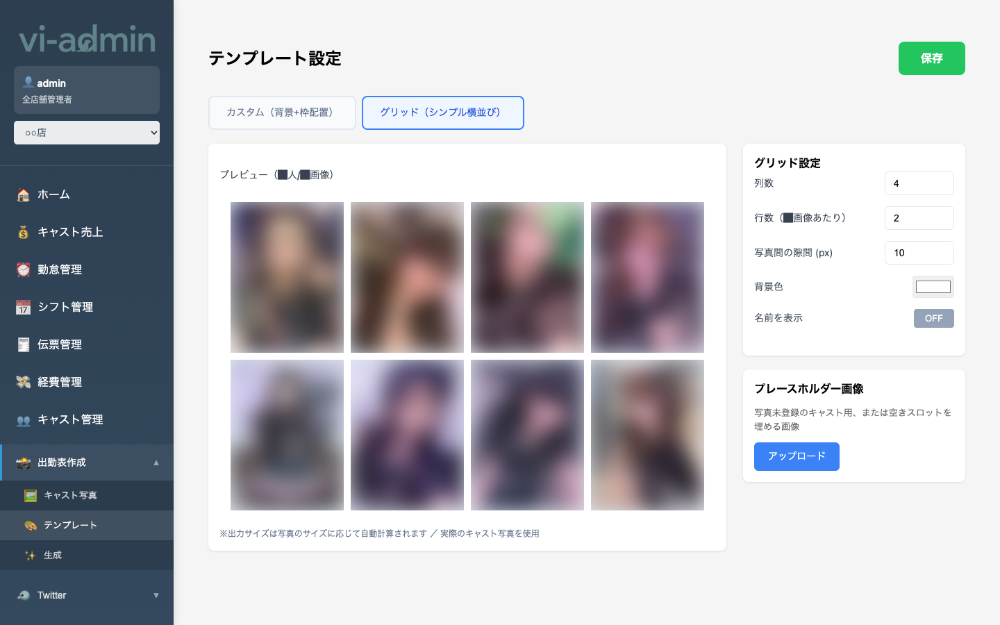
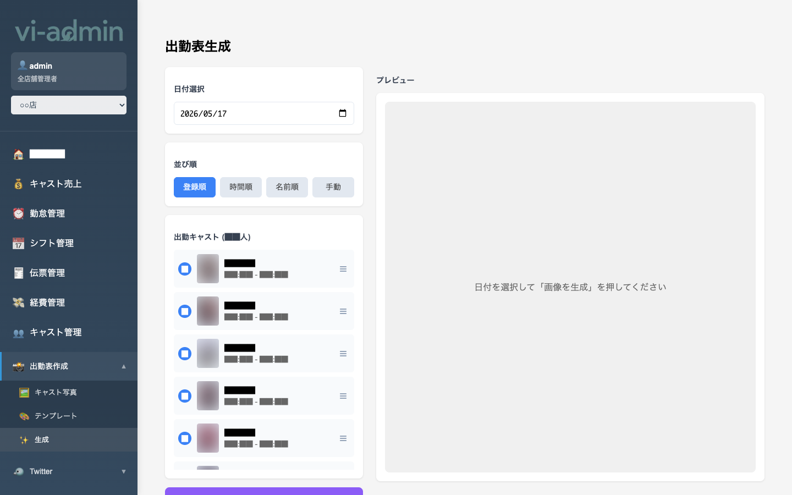

# 出勤表作成

SNS や店内掲示用の **出勤表画像** を自動生成する機能です。3 つのページで構成されています。

| サブメニュー | 内容 |
|---|---|
| キャスト写真 | 各キャストのプロフィール写真を登録・編集 |
| テンプレート | 出勤表のレイアウト・枠サイズを設定 |
| 出勤表生成 | 指定した日付の出勤表画像を自動生成 |

## キャスト写真 (`/schedule/photos`)

各キャストの **プロフィール写真** + **追加写真**（最大 3 枚、Webサイト用）を管理する画面です。

### 画面構成

| エリア | 説明 |
|---|---|
| 名前検索 | キャスト名で絞り込み |
| すべて / 登録済み / 未登録 タブ | 写真の登録状況で絞り込み |
| 切り抜き設定 ボタン | テンプレ枠の縦横比・グリッドモード切替 |
| キャスト一覧 | キャストの顔写真サムネがグリッドで並ぶ |

### よく使う操作

#### 写真をアップロードする

1. キャストカードをクリック → モーダルが開く
2. 「**写真を選択 / 写真を変更**」で画像を選ぶ
3. 切り抜きモード（カスタム / グリッド）で範囲を調整
4. アップロードボタンで保存

#### 既存写真の切り抜きを調整する

写真は登録されているが切り抜き位置が悪い場合:
1. キャストカード → モーダル
2. 「**切り抜き調整**」ボタン
3. 既存画像から切り抜き範囲を変えて保存

#### 写真を削除する

モーダルの「**写真を削除**」ボタン。

#### 追加写真（Webサイト用、最大3枚）

メイン写真の下に「追加写真」セクションが出ます。
- 「**+ 追加**」ボタンで新規アップロード（自動で 1200px / JPEG 85% に圧縮）
- 各写真に **‹ ›** で並び替え、**✕** で削除
- Webサイトのキャスト個別ページに使われる

## テンプレート (`/schedule/template`)

出勤表画像の **背景画像・レイアウト** を設定する画面です。

### 主な機能

| 機能 | 説明 |
|---|---|
| 背景画像アップロード | 出勤表のベース画像 |
| 枠サイズ設定 | キャスト写真をはめる枠の幅・高さ |
| グリッドモード | 規則的に並べる場合の列数指定 |
| 配置プレビュー | 設定が反映された見た目を確認 |

> 💡 テンプレートは店舗ごとに 1 つ。1 度設定すれば以降はそのままで出勤表を生成できます。

## 出勤表生成 (`/schedule/generate`)

設定したテンプレートとキャスト写真を使って、**指定日付の出勤表画像を生成・ダウンロード** する画面です。

### 操作手順

1. **日付を選択**（明日の出勤予定が反映される）
2. その日のシフトに入っているキャストが自動で並ぶ
3. 並びを手動で入れ替えたい場合はドラッグ&ドロップ
4. **「画像を生成」** ボタン → PNG / JPEG でダウンロード可能
5. ダウンロードした画像を SNS や店内掲示に使用

> 💡 シフト管理で確定したシフトが自動で反映されます。確定前のシフトは出ません。
