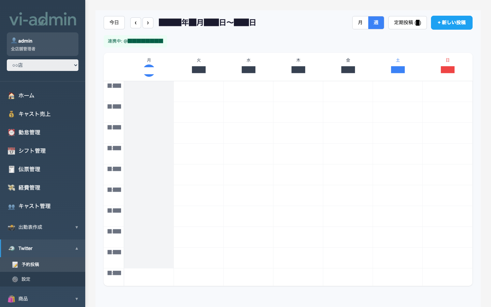
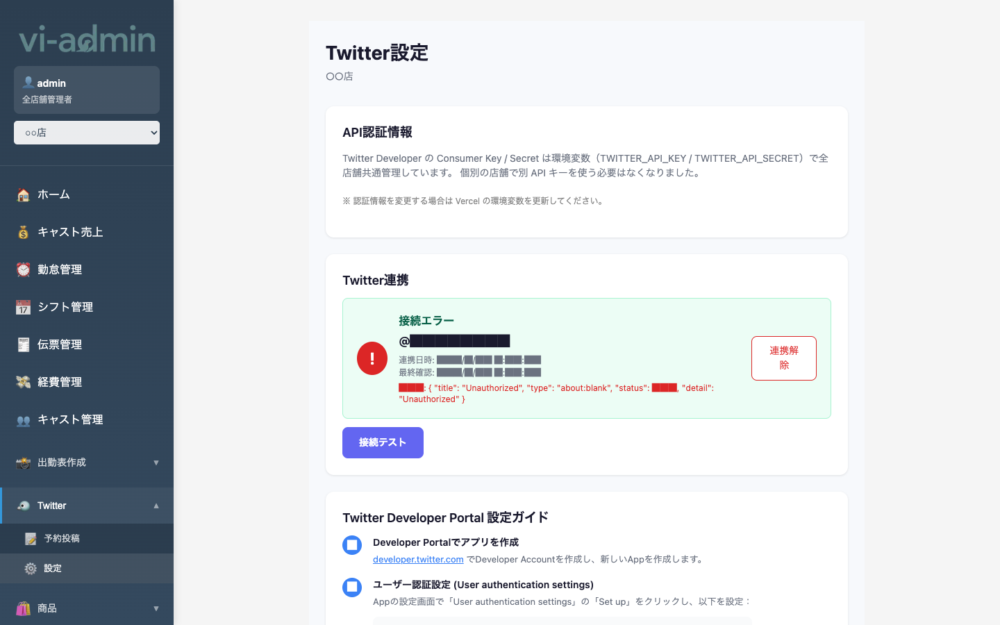

# Twitter 予約投稿

店舗の Twitter（X）アカウントと連携し、ツイートを予約投稿できる機能です。
出勤情報や日々のお知らせを自動投稿するのに使います。

| サブメニュー | 内容 |
|---|---|
| 予約投稿 | 投稿のスケジュール管理（カレンダー形式） |
| Twitter 設定 | アカウント連携・連携状態の確認 |

## 予約投稿 (`/twitter-posts`)

### 画面構成

| エリア | 説明 |
|---|---|
| 今日 / ◀ ▶ ナビ | 表示する週・月を移動 |
| 月 / 週 タブ | 表示形式を切替 |
| 定期投稿 (N) ボタン | 定期投稿（毎日 / 毎週）の一覧と編集 |
| + 新しい投稿 ボタン | 単発の予約投稿を作成 |
| 連携中: @ユーザー名 | 現在連携している Twitter アカウント |
| カレンダー | 予約投稿が時刻と内容を表示 |

### よく使う操作

#### 予約投稿を作成する

1. 右上の **「+ 新しい投稿」** ボタン
2. モーダルで以下を入力:
   - **投稿内容** (最大 280 文字)
   - **画像** (最大 4 枚、各 4MB 以下、自動圧縮)
   - **投稿日時**
3. プレビュー（モバイル/デスクトップ）で見た目を確認
4. **「投稿を予約」** ボタン

#### 既存の予約を編集する

カレンダー上の投稿カードをクリック → 編集モーダルが開く。
- 内容・画像・日時を変更して再保存
- 「投稿を予約」ボタンで上書き

#### 定期投稿を設定する

「**定期投稿 (N)**」ボタンで管理:
- 毎日 / 毎週（曜日指定）
- 投稿時刻
- 投稿内容と画像
- ON/OFF トグル

> 💡 定期投稿は cron 経由で 1 日に 1 回まとめて未来の予約投稿に変換されます。実行時間に注意。

#### 画像をアップロードする

投稿モーダルのドラッグ&ドロップエリアに画像を放り込みます。
- 4MB 超は自動圧縮（最大 1200px / JPEG 85%）
- 圧縮後も 4MB 超だとエラー

## Twitter 設定 (`/twitter-settings`)

### 画面構成

| 項目 | 説明 |
|---|---|
| 連携状態カード | 現在の連携状態（連携済 / 未連携 / 接続エラー） |
| @ユーザー名 | 連携中のアカウント |
| 連携日時 / 最終確認 | 連携した日時、最後にヘルスチェックした日時 |
| 連携する / 再連携 ボタン | Twitter の OAuth 認証フローを開始 |
| 解除 ボタン | 連携を解除 |

### よく使う操作

#### 初回連携する

1. **「連携する」** ボタンを押す
2. Twitter のログイン画面に遷移
3. ログイン後、アプリの権限を許可
4. 自動的に管理画面に戻る → 連携完了

#### 接続エラーが出た場合

「**接続エラー 401**」等が表示されたら、トークン期限切れの可能性大。
1. **「再連携」** ボタンを押す
2. もう一度 Twitter の OAuth 認証を通す

> 💡 Twitter アプリの API キーは全店舗共通で環境変数管理されてます。各店舗ごとの設定は不要、OAuth 連携のみ実施。
