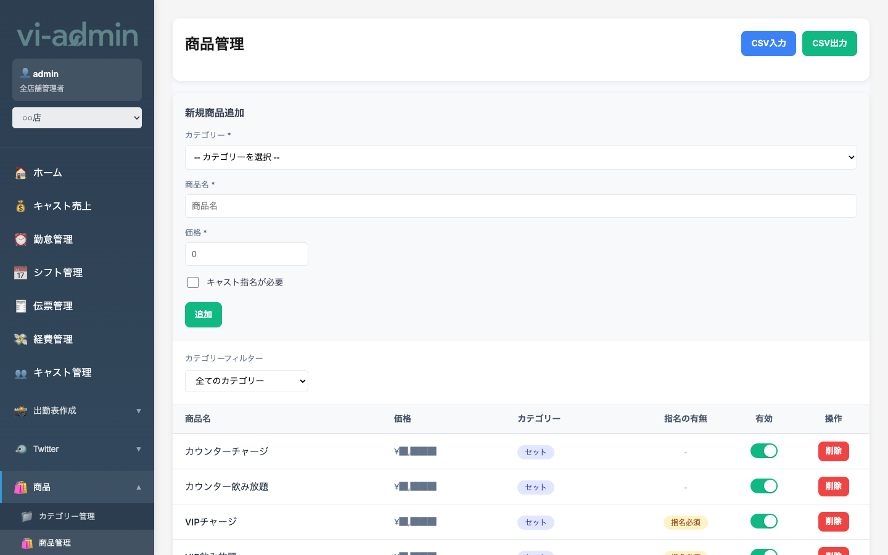
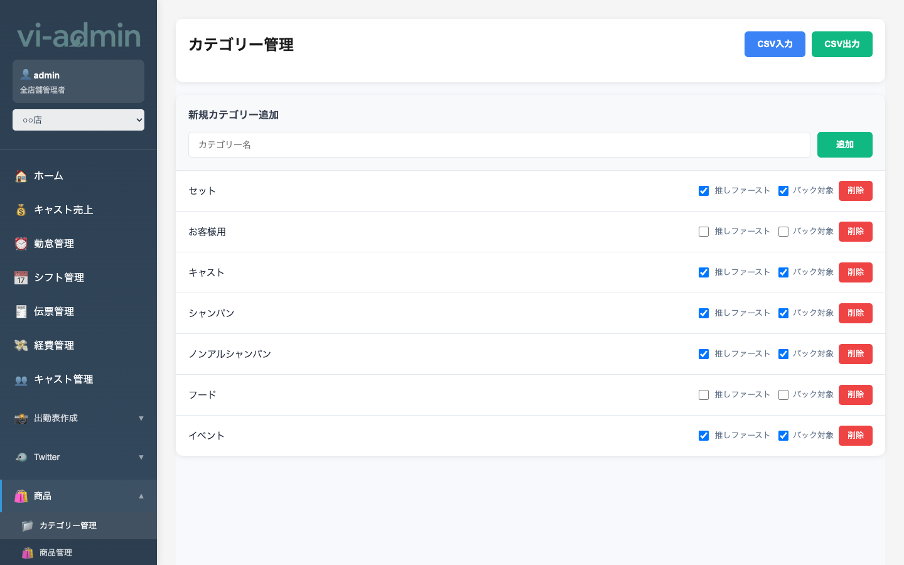

# 商品・カテゴリー管理

POS で扱う商品と、商品のグループ分け（カテゴリー）を管理する画面です。

| サブメニュー | 内容 |
|---|---|
| 商品管理 | 商品マスタ（個別の商品） |
| カテゴリー管理 | 商品カテゴリ（焼酎、ウォッカ、シャンパン 等） |

## 商品管理 (`/products`)

### 画面構成

| エリア | 説明 |
|---|---|
| 検索ボックス | 商品名・カテゴリで絞り込み |
| カテゴリ フィルター | 特定カテゴリの商品だけ表示 |
| + 新規追加 | 新規商品登録モーダルを開く |
| 商品一覧 | 商品名 / カテゴリ / 価格 / 表示順 など |
| 各行 | クリックで編集モーダル、トグルで POS 表示 ON/OFF |

### 商品の主な項目

| 項目 | 説明 |
|---|---|
| 商品名 | POS に表示される名前 |
| カテゴリ | カテゴリーマスタから選択 |
| 価格 | 税抜 or 税込（店舗設定に依存） |
| バック対象 | キャストへの売上バック計算で使うかどうか |
| 表示順 | POS 上での並び順 |
| POS 表示 | ON/OFF。OFF にすると POS の選択肢から消える |

### よく使う操作

#### 新規商品を追加する

1. **「+ 新規追加」** ボタン
2. モーダルで商品名・カテゴリ・価格・表示順を入力
3. 保存

#### 価格を変更する

商品の行をクリック → モーダルが開く → 価格を変更して保存。

> 💡 既存伝票には影響しません（過去の伝票は当時の価格で固定）。新しい伝票から新価格が適用されます。

#### 商品を一時的に非表示にする

各行のトグルで **POS 表示 ON/OFF** を切替。
- OFF にすると POS の商品選択画面から消える
- 削除ではないので、再度 ON にすればすぐ復活

## カテゴリー管理 (`/categories`)

### 画面構成

カテゴリー一覧。カテゴリー名 / 表示順 / 含まれる商品数 などを表示。

### よく使う操作

#### 新規カテゴリーを追加する

1. **「+ 新規追加」** ボタン
2. カテゴリー名と表示順を入力
3. 保存

#### カテゴリーを編集する

行をクリック → 名前・表示順を変更可能。

#### 並び替え

行のドラッグ&ドロップで POS 上での並び順を変更できます。
