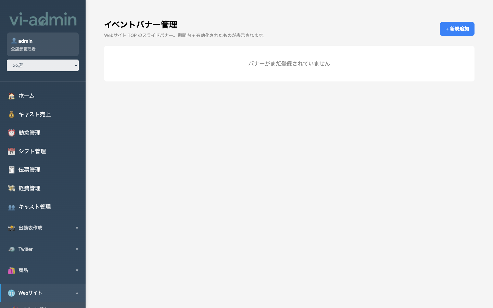

# Webサイト設定

公開 Web サイト（memorable.cafe など）に表示するバナー画像を管理する画面です。

## バナー管理 (`/website-banners`)

### 画面構成

| エリア | 説明 |
|---|---|
| バナー一覧 | アップロード済みバナー画像のサムネ |
| ドラッグ&ドロップエリア | 新規バナーをアップロード |
| 各バナーカード | プレビュー / 順序入れ替え / 削除 / リンク URL 設定 |

## よく使う操作

### バナーを追加する

1. ドラッグ&ドロップエリアに画像ファイルを放り込む
2. または「ファイル選択」ボタン
3. 5MB 超は自動圧縮（最大 1600px → 1280px → 1024px ... と段階的にサイズ縮小）

### バナーの並び順を変える

サムネをドラッグして移動。Web サイト側でも反映されます。

### バナーにリンクを設定する

各バナーカードの URL 入力欄に遷移先 URL を入れて保存。Web サイトでバナーをクリックすると指定 URL に飛ぶようになる。

### バナーを削除する

バナーカードの **「✕」削除ボタン** をクリック。

> 💡 アップロード後の反映は Web サイト側のキャッシュ仕様により数分かかる場合があります。

## キャスト追加写真（メイン写真とは別）

キャスト個別ページに表示する追加写真（最大 3 枚）は **「出勤表作成 → キャスト写真」** ページから管理します（[08-出勤表作成.md](08-出勤表作成.md) 参照）。
