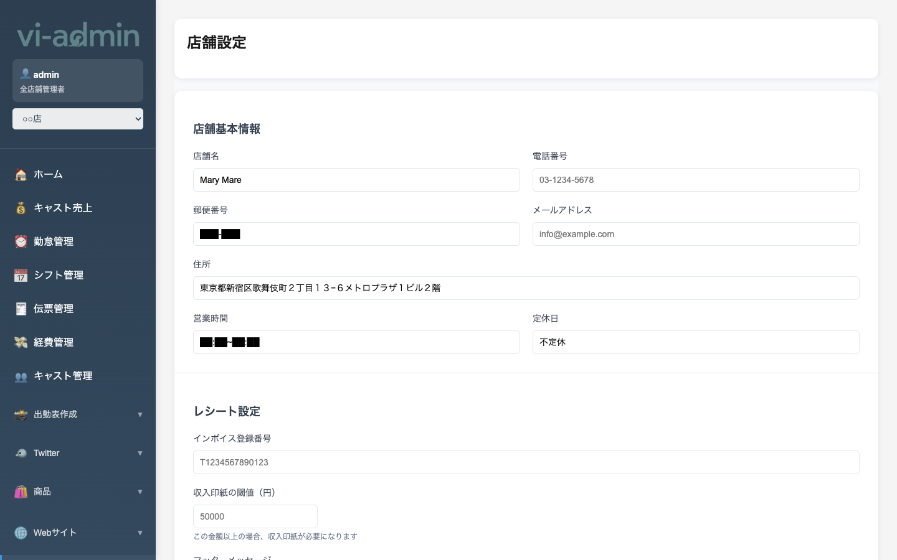

# 店舗・LINE 設定

店舗の基本情報や LINE Bot 連携の設定を行う画面です。

| サブメニュー | 内容 |
|---|---|
| 店舗設定 | 店舗の基本情報（名前・住所・電話・税率など） |
| LINE 設定 | LINE Bot のチャネルアクセストークン・Webhook 設定 |
| LINE 一斉送信 | 全キャストに LINE で一斉メッセージ送信 |

## 店舗設定 (`/store-settings`)

### 主な設定項目

| 項目 | 説明 |
|---|---|
| 店舗名 | 表示用の正式名称 |
| 略称 | サイドメニューや POS で使う短い名前 |
| 住所 | 店舗の所在地 |
| 電話番号 | 店舗の電話 |
| メールアドレス | 連絡先 |
| 営業時間 | 開店・閉店時刻 |
| 税率 | 売上計算に使う消費税率（10% 等） |
| 営業日 | 月～日のうち営業する曜日 |
| 定休日 | 休業日の登録 |

### よく使う操作

#### 店舗情報を変更する

各入力欄を編集 → **「保存」ボタン**。
- 保存後の数値は POS、キャスト売上、伝票管理 など全画面で反映されます

#### 営業時間を変更する

開店・閉店時刻を 24 時間表記で入力（例: 20:00 〜 02:00）。
- 0 時を跨ぐ場合は閉店時刻が翌日扱いになる

#### 税率を変更する

税率は売上計算ロジックに直結するので、変更前に既存伝票への影響を確認してください。

> 💡 通常運用では税率は変更不要。法改正時のみ変更してください。

## LINE 設定 (`/line-settings`)

LINE Bot との連携を有効化する画面（管理者向け）。

| 項目 | 説明 |
|---|---|
| チャネルアクセストークン | LINE Developers から発行 |
| チャネルシークレット | 同上 |
| Webhook URL | 自動で表示 → LINE Developers に登録 |
| 有効化トグル | LINE 連携の ON/OFF |

> 💡 LINE 設定は **管理者専用** の場合があります。店舗管理者の権限では非表示の可能性。
> 連携時の手順詳細は別途管理者にお問い合わせください。

## LINE 一斉送信 (`/line-broadcast`)

全キャストに同じメッセージを LINE で一斉送信する画面（管理者向け）。

| 機能 | 説明 |
|---|---|
| メッセージ作成 | テキスト + 画像 |
| 送信対象選択 | 全キャスト / 特定属性で絞り込み |
| 送信実行 | 即時送信 or 予約送信 |

> 💡 LINE 一斉送信は **管理者専用**。営業メッセージや緊急連絡に使います。
